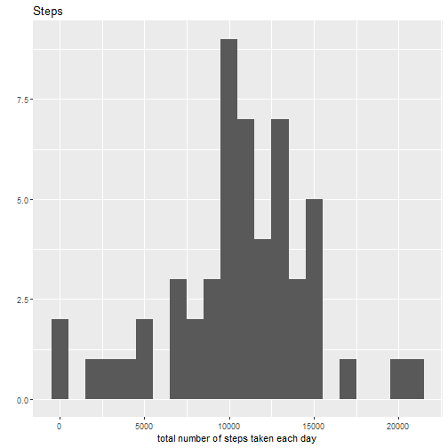
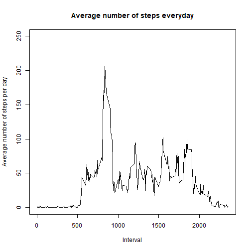
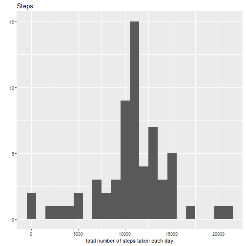
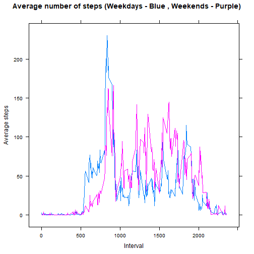

#RMarkDown Peer Project 1

##Loading the data:


```r
data <-
    read.csv("./repdata_data_activity/activity.csv", header = TRUE)
```

##Preprocessing of data:

```r
library(ggplot2)
library(lattice)
req_data <-
    matrix(
        data$steps,
        nrow = length(unique(data$interval)),
        ncol = length(unique(as.Date(data$date))),
        byrow = FALSE
    )
colnames(req_data) <- unique(data$date)
rownames(req_data) <- unique(data$interval)
req_data <- as.table(req_data)
```

##What is mean total number of steps taken per day?:

```r
req <- array(dim = length(colnames(req_data)))

for (i in 1:length(colnames(req_data)))
{
    req[i] <- sum(req_data[, i])
}

qplot(req,
      binwidth = 1000,
      main = "Steps" ,
      xlab = "total number of steps taken each day")
```

```
## Warning: Removed 8 rows containing non-finite values (stat_bin).
```



```r
mean_steps1 <- mean(req, na.rm = TRUE)
median_steps1 <- median(req, na.rm = TRUE)
mean_steps1
```

```
## [1] 10766.19
```

```r
median_steps1
```

```
## [1] 10765
```

##What is the average daily activity pattern?:

```r
req1 <- array(dim = length(unique(data$interval)))

for (i in 1:length(unique(data$interval)))
{
    req1[i] <- mean(req_data[i,], na.rm = TRUE)
}
plot(
    unique(data$interval),
    req1,
    type = "l",
    ylim = c(0, 250),
    main = "Average number of steps everyday",
    xlab = "Interval",
    ylab = "Average number of steps per day"
    
)
```



```r
maximum_steps <- max(req1)
for (i in 1:length(unique(data$interval)))
{
    if (maximum_steps == req1[i])
    {
        num = i
    }
}
interval_array <- unique(data$interval)
max_interval <- interval_array[num]
max_interval
```

```
## [1] 835
```

##Imputing missing values:

```r
total_nas <- matrix(subset(req_data, is.na(req_data)))
total_nas <- nrow(total_nas)
total_nas
```

```
## [1] 2304
```

```r
mean_steps <- array(dim = length(colnames(req_data)))


for (i in 1:length(rownames(req_data)))
{
    mean_steps[i] <- mean(req_data[i,], na.rm = TRUE)
}

req_data1 <- req_data
for (i in 1:length(rownames(req_data1)))
{
    for (j in 1:length(colnames(req_data1)))
        if (is.na(req_data1[i, j]))
        {
            req_data1[i, j] <- as.integer(mean_steps[i])
        }
}


req2 <- array(dim = length(colnames(req_data1)))

for (i in 1:length(colnames(req_data1)))
{
    req2[i] <- sum(req_data1[, i])
}

qplot(req2,
      binwidth = 1000,
      main = "Steps" ,
      xlab = "total number of steps taken each day")
```



```r
mean_steps2 <- mean(req2, na.rm = TRUE)
median_steps2 <- median(req2, na.rm = TRUE)
mean_steps2
```

```
## [1] 10749.77
```

```r
median_steps2
```

```
## [1] 10641
```
Do these values differ from the estimates from the first part of the assignment? What is the impact of imputing missing data on the estimates of the total daily number of steps?

Answer: Yes, the values do differ, but not by a large margin. THis difference occurs due to the introduction of new values instead of the NA values.

##Are there differences in activity patterns between weekdays and weekends?:

```r
req_data1 <-
    rbind(req_data1, weekdays.Date(unique(as.Date(data$date))))

last <- length(rownames(req_data1))
req_data1 <- rbind(req_data1, 0)
for (i in 1:length(colnames(req_data1)))
{
    if (req_data1[last, i] %in% c("Monday", "Tuesday", "Wednesday", "Thursday", "Friday"))
    {
        req_data1[last + 1, i] <- "Weekday"
    }
    else
    {
        req_data1[last + 1, i] <- "Weekend"
    }
}

temp1 <-
    as.table(subset(req_data1, select = req_data1[last + 1,] %in% "Weekday"))


req3 <- array(dim = last - 1)

for (i in 1:last - 1)
{
    req3[i] <- mean(as.integer(temp1[i,]))
}


temp2 <-
    as.table(subset(req_data1, select = req_data1[last + 1,] %in% "Weekend"))

req4 <- array(dim = last - 1)

for (i in 1:last - 1)
{
    req4[i] <- mean(as.integer(temp2[i,]))
}


xyplot(
    req3 + req4 ~ unique(data$interval),
    type = "l",
    main = "Average number of steps (Weekdays - Blue , Weekends - Purple)",
    xlab = "Interval",
    ylab = "Average steps"
)
```



This plot shows that there are clear and noticeable differences between the number of stepa taken in weekdays and weekends.
